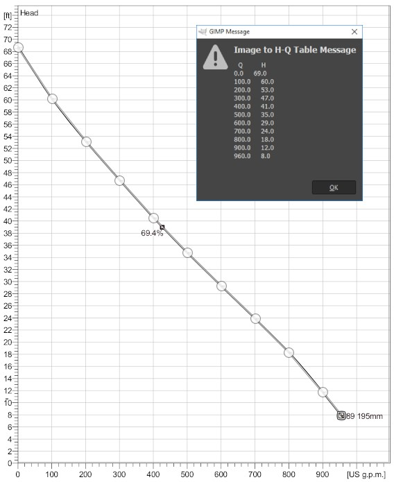
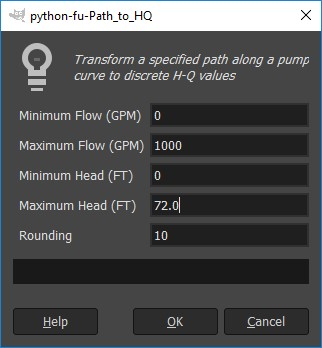

# pumpHQ 
## GIMP-Python Plug-In

Interpolates points along a curve from an image.

## Step 1: Select the Path Tool
Using the path tool, set the first anchor of the shut-off head (maximum head at zero flow).  Continue selecting points along the curve, working right toward pump runout.

Typically 10 or so points provides a good curve definition.

Capture any major changes in the curve shape.
 

## Step 2: Define the Boundary
Then using the same path, select:
-	Maximum Flow on the Horizontal Axis
-	Axis intercept, often (0,0)
-	Maximum Head on the Vertical Axis
 
## Step 3: Run the Plug-In

Open the “Image to H-Q Table” tool under Filters and define the boundary values.

The script rotates the pump curve about the axis intercept (if needed) and rounds to the nearest user-defined interval.
